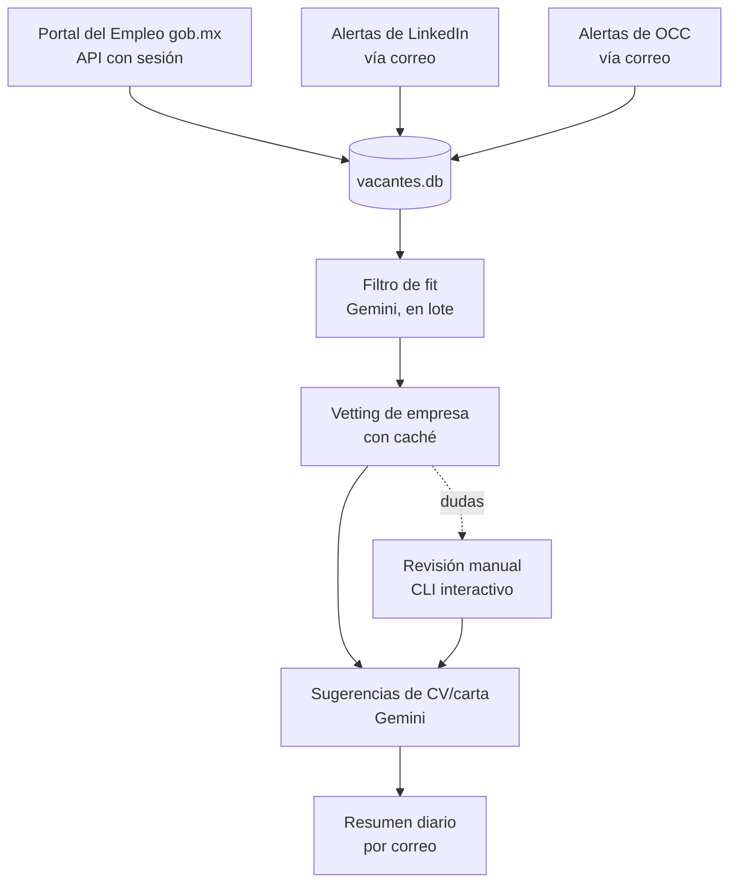

# Job Search Automation Pipeline

Pipeline automatizado y de costo cero para la búsqueda activa de empleo como ML Engineer en México: descubre vacantes nuevas todos los días, evalúa qué tan bien encajan con mi perfil, investiga la legitimidad de las empresas, y genera sugerencias puntuales de qué cambiar en mi CV y carta de presentación para cada una — sin redactar documentos completos ni automatizar el envío de aplicaciones.

## Por qué existe

Como parte de mi transición de Física a Machine Learning Engineering, quería un sistema que buscara vacantes de forma activa sin depender de scraping agresivo de plataformas como LinkedIn (que lo prohíbe explícitamente en sus Términos de Servicio) ni de herramientas de pago. El resultado es un sistema que combina fuentes legítimas de datos (una API gubernamental, alertas de correo oficiales) con la API gratuita de Gemini para el análisis.

## Arquitectura



Orquestado por el Programador de Tareas de Windows (no por n8n — ver "Decisiones técnicas" abajo), corriendo diariamente sin intervención.

## Stack

Python 3.13 + `uv` · SQLite · Gemini API (free tier) · `requests` + `BeautifulSoup4` para scraping/parsing · `imaplib` para Gmail · Windows Task Scheduler para orquestación

## Estructura del proyecto

```
├── db_schema.py          # Esquema único de la base de datos
├── profile.yml           # Perfil del candidato (sin datos de contacto)
├── gob/                  # Descubrimiento: API de gob.mx
├── link_occ/             # Descubrimiento: alertas de LinkedIn/OCC vía correo
├── filtro_ia/             # Filtro de fit, vetting de empresa, sugerencias de CV
└── run_pipeline_diario.bat
```

## Decisiones técnicas y lecciones aprendidas

Este proyecto involucró más ingeniería real de la que un pipeline de IA "feliz" suele requerir:

- **Autenticación de API no documentada**: la API de gob.mx no tiene documentación pública. Se recuperó por ingeniería inversa inspeccionando el tráfico de red del sitio, confirmando empíricamente (no por suposición) qué headers eran realmente necesarios.
- **Decisión consciente de no pelear contra bot-detection**: OCC está protegido por Cloudflare Bot Management. En vez de intentar evadirlo, se rediseñó esa fuente para usar sus alertas oficiales por correo — mismo patrón de datos, cero riesgo de ToS.
- **Manejo de cuota de API en producción**: el proyecto migró de modelo (`gemini-flash-latest` → `gemini-3.5-flash-lite`) al descubrir en producción que el primero tiene ~20 solicitudes gratis/día contra 500 del segundo — diagnosticado aislando variables (grounding vs. sin grounding, modelo por modelo) en vez de asumir la causa.
- **Diseño consciente de privacidad**: el perfil que se envía a la API de Gemini nunca incluye nombre, correo ni teléfono — esos datos solo existen en el CV real, fuera del pipeline.
- **Grounding degradado con elegancia**: cuando se descubrió que la búsqueda real (Google Search grounding) ya no está disponible gratis para cuentas nuevas, el vetting de empresas se rediseñó para ser honesto sobre esa limitación en vez de fingir una investigación que no puede hacer.

## Setup

```bash
git clone <repo>
cd job-search-automation
uv sync
cp .env.example .env   # y llena tus credenciales reales
```

1. Llena `profile.yml` con tu propio perfil (plantilla sin datos personales incluida).
2. Genera una contraseña de aplicación de Gmail en `myaccount.google.com/apppasswords` (requiere verificación en 2 pasos).
3. Genera una API key gratis en Google AI Studio.
4. Programa `run_pipeline_diario.bat` en el Programador de Tareas de Windows (diario, recomendado por la mañana).

## Uso manual

```bash
cd filtro_ia
uv run revisar_dudas.py     # resolver vacantes marcadas con dudas de legitimidad
uv run ver_sugerencias.py   # revisar sugerencias y marcar aplicaciones enviadas
```

## Limitaciones conocidas

- El vetting de empresas corre sin búsqueda real (grounding no disponible gratis en cuentas nuevas de Gemini) — depende del conocimiento entrenado del modelo, y es honesto cuando no reconoce una empresa.
- No hay deduplicación entre fuentes (la misma vacante puede aparecer una vez por gob.mx y otra por LinkedIn).
- Depende de que la laptop esté encendida y con sesión iniciada a la hora programada.

## Licencia

MIT
